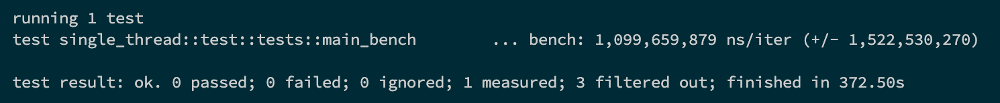
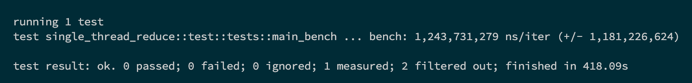
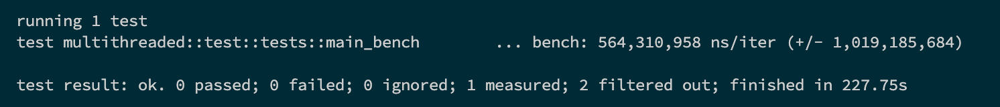
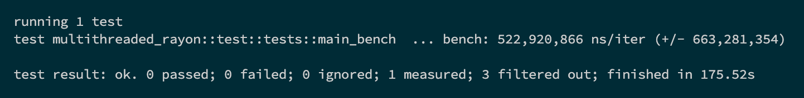
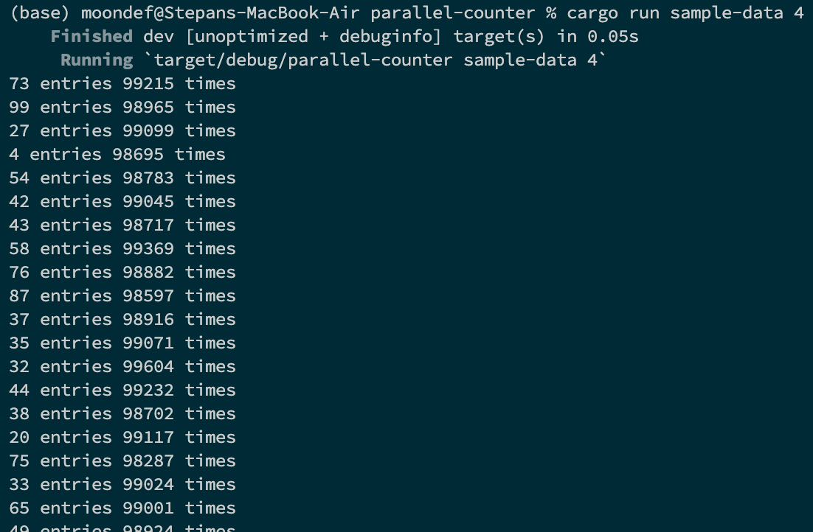

# parallel-counter
A Rust program for counting words in files using [MapReduce](https://en.wikipedia.org/wiki/MapReduce) principle

## Implementations
1. In a single thread
2. In a single thread with `map/reduce`
3. Multithreaded
4. Multithreaded with `map/reduce`

## Installing & Setup
1. Clone repo\
`git clone https://github.com/moondef/parallel-counter`

2. Add a folder named `sample_data` with mock files to root
Folder structure:
```
sample_data/
--file1.txt
--file2.txt
... 
```

`txt` file example:
```
a
1
1
the
2
the
```

3. Run program\
`cargo run sample_data {implementation}`

See available implementations [here](#implementations)


## Benchmarks
Using single thread


Using single thread with `map/reduce`


Using multithreading


Using multithreading with `map/reduce`


## Results
All implementations have the same output

